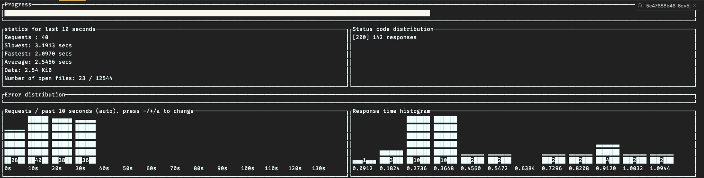
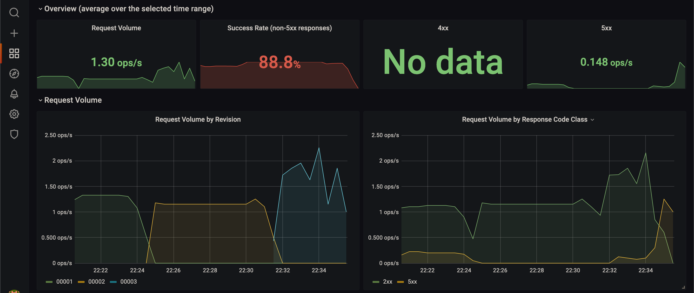

# Benchmark

`oha` is used to benchmark the API :


## Usage

```bash
cargo install oha
oha http://<API_IP>/predict -m POST --host translate.api.example.com -d'["Some test sentence to translate"]' -c 10 -z 1m
```

More details are available on Grafana / Knative Serving - Revision HTTP Requests

