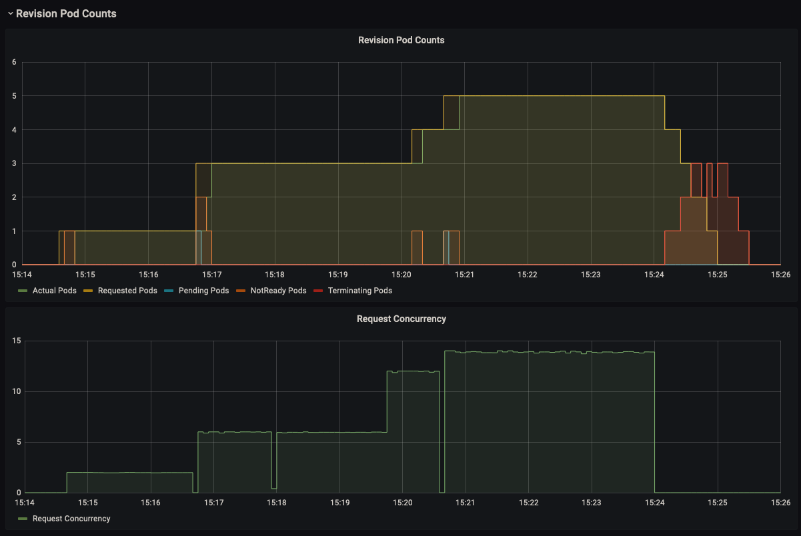

# Benchmark

`oha` is used to benchmark the API :


## Usage

```bash
cargo install oha
oha http://<API_IP>/predict -m POST --host translate.api.example.com -d'["Some test sentence to translate"]' -c 10 -z 1m
```

More details are available on Grafana / Knative Serving - Revision HTTP Requests

## Results

Since we use knative it can scale to 0 and still answer to all requests.  
We start with 2 requests in parallel, then 6, 12, and 14.  
We can see that as the concurrency increase the number of pods is scaling up and the request per seconds answered is increasing linearly.  




